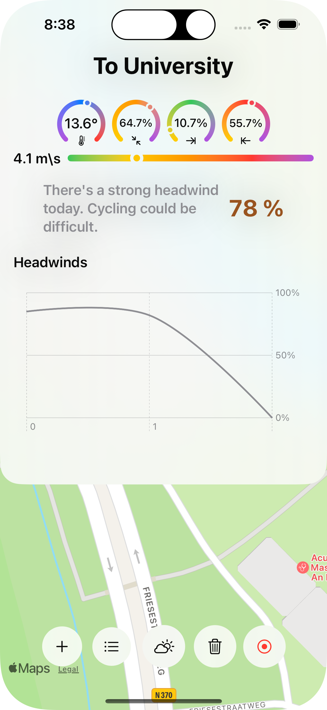

# WindRider

WindRider is an iOS application that helps cyclists determine the best time to ride based on the current and forecasted wind conditions. The app analyzes a predetermined bike path and calculates the direction of the bike throughout the journey. It then compares this with real-time weather data to determine the amount of headwind or tailwind a cyclist will encounter on any given day or moment. 

## Features

- **Bike Path Analysis**: Create a predetermined path between two points (e.g., home and university campus), and the app will calculate the direction of travel at equal points along the path.
  
- **Weather Impact Analysis**: The app retrieves real-time weather data and determines what parts of the trip will be against the wind (headwind) and what parts will be with the wind (tailwind).
  
- **Comfortability Score**: Based on the wind direction and speed, the app determines the comfortability of cycling in those specific weather conditions, helping you decide if it's a good day to cycle or not.

## Screenshots

    
    
    

## Code Structure

The project consists of several Swift files:

- `ContentView.swift`: The main view of the app, which includes a map view and buttons for various functions such as adding a new path, selecting a route, analyzing the weather impact, and deleting paths.

- `RouteConditionPreviewView.swift`: A view that displays the calculated weather impacts on the selected path. It shows the temperature, wind speed, and percentages of headwind, tailwind, and crosswind.

- `WeatherImpactAnalysisEngine.swift`: A class that handles the analysis of weather impact on a given cycling path. It fetches weather conditions for the path, calculates the impact on each coordinate, and provides a holistic score representing the weather impact on the path.

Please refer to the comments in the code for more detailed explanations of each function.

## How to Use

1. Create a predetermined bike path.
2. The app will analyze the direction of the bike throughout the path.
3. It will fetch real-time weather data and calculate the amount of headwind or tailwind on the path.
4. Based on the analysis, the app will provide a comfortability score and a recommendation on whether it's a good day to cycle or not.

## Requirements

- iOS 17.0 or later
- Xcode 15.0 or later

## License

This project is licensed under the MIT License.
